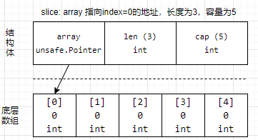
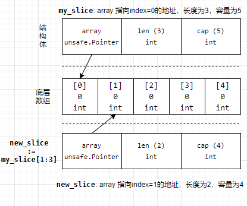

# slice(切片)

## slice的存储结构
Go中的slice依赖于数组，它的底层就是数组，所以数组具有的优点，slice都有。且slice支持可以通过append向slice中追加元素，长度不够时会动态扩展，通过再次slice切片，可以得到得到更小的slice结构，可以迭代、遍历等。

实际上slice是这样的结构：先创建一个有特定长度和数据类型的底层数组，然后从这个底层数组中选取一部分元素，返回这些元素组成的集合(或容器)，并将slice指向集合中的第一个元素。换句话说，slice自身维护了一个指针属性，指向它底层数组中的某些元素的集合。

```golang
my_slice := make([]int, 3, 5)
fmt.Println(my_slice)    // 输出：[0 0 0]
```
表示先声明一个长度为5、数据类型为int的底层数组，然后从这个底层数组中从前向后取3个元素(即index从0到2)作为slice的结构。

源码：go/src/runtime/slice.go
结构体定义
```golang
type slice struct {
	array unsafe.Pointer
	len   int
	cap   int
}
```


每一个slice结构都由3部分组成：容量(capacity)、长度(length)和指向底层数组某元素的指针，它们各占8字节(1个机器字长，64位机器上一个机器字长为64bit，共8字节大小，32位架构则是32bit，占用4字节)，所以任何一个slice都是24字节(3个机器字长)。

- Pointer：表示该slice结构从底层数组的哪一个元素开始，该指针指向该元素
- Capacity：即底层数组的长度，表示这个slice目前最多能扩展到这么长
- Length：表示slice当前的长度，如果追加元素，长度不够时会扩展，最大扩展到Capacity的长度(不完全准确，后面数组自动扩展时解释)，所以Length必须不能比Capacity更大，否则会报错

可以通过len()函数获取slice的长度，通过cap()函数获取slice的Capacity。
```go
my_slice := make([]int,3,5)
fmt.Println(len(my_slice))  // 3
fmt.Println(cap(my_slice))  // 5
```

还可以直接通过print()或println()函数去输出slice，它将得到这个slice结构的属性值，也就是length、capacity和pointer：
```go
my_slice := make([]int,3,5)
println(my_slice)      // [3/5]0xc42003df10
```

`[3/5]`表示length和capacity，`0xc42003df10`表示指向的底层数组元素的指针。
务必记住slice的本质是`[x/y]0xADDR`，记住它将在很多地方有助于理解slice的特性。另外，个人建议，虽然slice的本质不是指针，但仍然可以将它看作是一种包含了另外两种属性的不纯粹的指针，也就是说，直接认为它是指针。其实不仅slice如此，map也如此。

## 创建、初始化、访问slice
- make()：
```go
// 创建一个length和capacity都等于5的slice
slice := make([]int,5)
// length=3,capacity=5的slice
slice := make([]int,3,5)
```
make只能构建slice、map和channel这3种结构的数据对象，因为它们都指向底层数据结构，都需要先为底层数据结构分配好内存并初始化。
- new():
```golang
my_slice := new([]int)
fmt.Println(my_slice) // &[]
```
make()比new()函数多一些操作，new()函数只会进行内存分配并做默认的赋0初始化，而make()可以先为底层数组分配好内存，然后从这个底层数组中再额外生成一个slice并初始化。


- 直接赋值初始化：
```golang
// 创建长度和容量都为4的slice，并初始化赋值
color_slice := []string{"red","blue","black","green"}
// 创建长度和容量为100的slice，并为第100个元素赋值为3
slice := []int{99:3}
```
注意区分array和slice：
```golang
// 创建长度为3的int数组
array := [3]int{10, 20, 30}
// 创建长度和容量都为3的slice
slice := []int{10, 20, 30}
```
由于slice底层是数组，所以可以使用索引的方式访问slice，或修改slice中元素的值：
```golang
// 创建长度为5、容量为5的slice
my_slice := []int{11,22,33,44,55}
// 访问slice的第2个元素
print(my_slice[1])
// 修改slice的第3个元素的值
my_slice[2] = 333
```
lice能被访问的元素只有length范围内的元素，那些在length之外，但在capacity之内的元素暂时还不属于slice，只有在slice被扩展时(见下文append)，capacity中的元素才被纳入length，才能被访问。


## nil slice和空slice
当声明一个slice，但不做初始化的时候，这个slice就是一个nil slice。
```golang
// 声明一个nil slice
var nil_slice []int
println(nil_slice)// [0/0]0x0
```
nil slice表示它的指针为nil，也就是这个slice不会指向哪个底层数组。也因此，nil slice的长度和容量都为0。但是循环不会报错。

还可以创建空slice(Empty Slice)，空slice表示长度为0，容量为0，但却有指向的slice，只不过指向的底层数组暂时是长度为0的空数组。

```golang
// 使用make创建
empty_slice := make([]int,0)
// 直接创建
empty_slice := []int{}
println(empty_slice) // [0/0]0xc000049f48
```
虽然nil slice和Empty slice的长度和容量都为0，输出时的结果都是[]，且都不存储任何数据，但它们是不同的。nil slice不会指向底层数组，而空slice会指向底层数组，只不过这个底层数组暂时是空数组。

当然，无论是nil slice还是empty slice，都可以对它们进行操作，如append()函数、len()函数和cap()函数。


## 对slice进行切片
语法为：
```
SLICE[A:B]
SLICE[A:B:C]
```
其中A表示从SLICE的第几(A+1)个元素开始切，B控制切片的长度(B-A)，C控制切片的容量(C-A)，如果没有给定C，则表示切到底层数组的最尾部。

还有几种简化形式：
```
SLICE[A:]  // 从A切到最尾部
SLICE[:B]  // 从最开头切到B(不包含B)
SLICE[:]   // 从头切到尾，等价于复制整个SLICE
```


这时新slice的length等于capacity，底层数组的index=4、5将对new_slice永不可见，即使后面对new_slice进行append()导致底层数组扩容也仍然不可见。具体见下文。

由于多个slice共享同一个底层数组，所以当修改了某个slice中的元素时，其它包含该元素的slice也会随之改变，因为slice只是一个指向底层数组的指针(只不过这个指针不纯粹，多了两个额外的属性length和capacity)，实际上修改的是底层数组的值，而底层数组是被共享的。

当同一个底层数组有很多slice的时候，一切将变得混乱不堪，因为我们不可能记住谁在共享它，通过修改某个slice的元素时，将也会影响那些可能我们不想影响的slice。所以，需要一种特性，保证各个slice的底层数组互不影响，相关内容见下面的"扩容"。

## copy()函数
## append()函数
https://www.cnblogs.com/f-ck-need-u/p/9854932.html